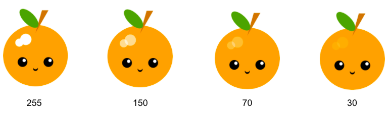

يمكنك إنشاء ألوان شفافة جزئيًا عن طريق إضافة رقم رابع إلى لون RGB لإعطاء "عتامة".

يرسم هذا الرمز النقاط البارزة المتداخلة في مثال فاكهة الكيوي:

--- code ---
---
language: python
filename: main.py - draw()
---

  # تسليط الضوء 
    fill(255, 255, 255, 70) # الدرجة 70 هي للشفافية / العتامة هنا
    ellipse(170, 150, 35, 35) 
    ellipse(150, 160, 25, 25)

--- /code ---

