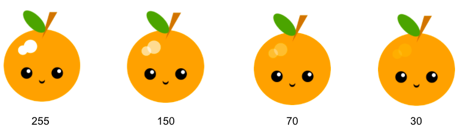

Μπορείς να δημιουργήσεις μερικώς διαφανή χρώματα προσθέτοντας έναν τέταρτο αριθμό σε ένα χρώμα RGB για να δώσεις «αδιαφάνεια».

Αυτός ο κώδικας σχεδιάζει επικαλυπτόμενα φωτεινά σημεία στο παράδειγμα με τα φρούτα Kawaii:

--- code ---
---
language: python
filename: main.py - draw()
---

  # Highlights fill(255, 255, 255, 70) # 70 is transparency/opacity here ellipse(170, 150, 35, 35) ellipse(150, 160, 25, 25)

--- /code ---

